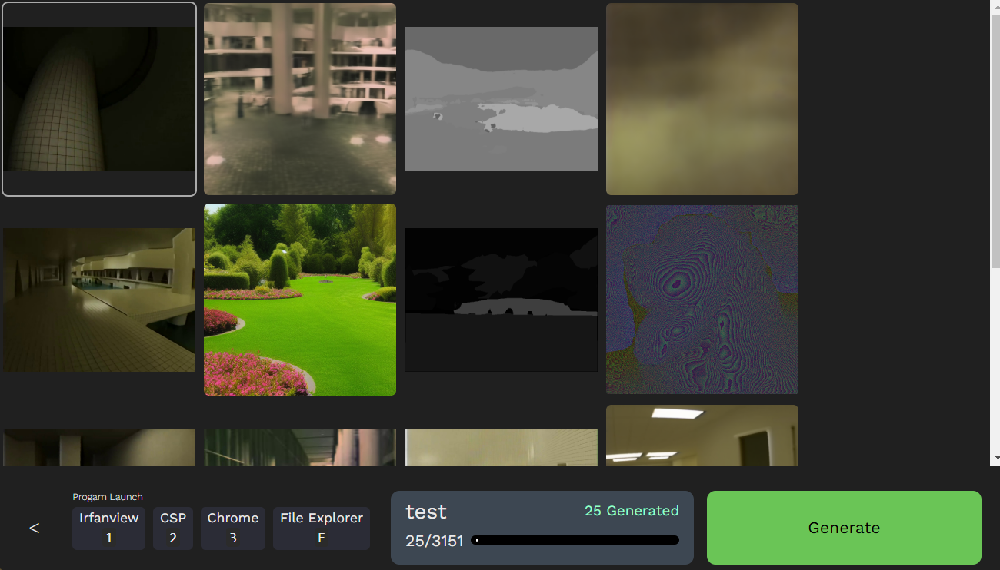
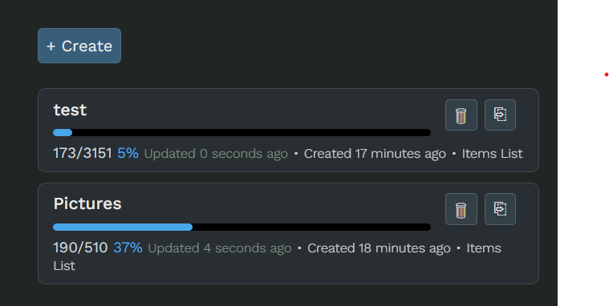

# Image Randomiser
Tool for randomising folders of images.

This tool **does not** generate images with AI. This tool is for showing images from folders on the file system.

# Use Case Ideas
## Looking for a reference image
You might have a large set of saved images and are looking for images with certain qualities.  When images are scattered across many folders, this can be annoying to do. Also, looking for images when they are in the same order every time leads to getting used to the order of images. A shuffled image set provides a fresh perspective on your images reference set.

With large reference sets, it can take some time to iterate through images. Without something tracking the images you have already seen, time can be wasted looking at images that have already been considered. The Sessions feature assists with this by saving progress of images viewed so they aren't seen again in the same session.

# Features
- Create sessions by dragging in folders from your file system
    - All image files will be included from the dragged folders (including subfolders)
- Open session to Generate images from a random selection of items in the selected folders
    - Images do not repeat once viewed, allowing you to eventually iterate through all items in a session
    - Can leave and resume the session later without losing progress
- Open image in various programs
    - Shortcut keys can be used to instantly open the image in configurable set of programs, such as a drawing application
    - Todo: still need to implement the configurable aspect
- Multiple session support
    - Easily create more sessions for simultaneous image searching needs
    - All folders dragged into the program are remembered for easy re-access without having to drag it in again

# Screenshots
## Session Page

- Page for selecting created Sessions
- Ordered by last time a session was used
- Buttons to delete and duplicate session
    - When session is duplicated, able to choose new name for the session
    - Items are reshuffled, so although it will have the same items, it will be in a new unique order

## Image Randomiser Page

- Main page where items from session are viewed
- Items are picked from all the selected folders during session creation and shown in random order
- A random amount of images is shown at a time
- Generate button can be used to move to the next set of images
    - Can also press "Enter" or "Space"
- When image is shown, it will not be shown again. This allows you to eventually see all of the images in the selected folders
    - You can go through the same items again by duplicating the session
- Generated amount (green) shows how many images were viewed since opening this page. Leaving the page and coming back will reset this
    - This allows you to keep track of how many images you have gone through at the moment, so you can set a stopping point (i.e., only want to go through 100 images)
- Selecting an image will show its filepath
- Program Launch buttons can be used to open the selected image in the corresponding program
    - The indicated keyboard buttons can also be used
- The back arrow or "Esc" key can be used to return to Session Select

# Session Create Page

- Create sessions by dragging in folders
- Can also select folders that were previously dragged in using the Recent Items section
    - The number next to items in the Recent Item section is how many times the particular item has been used
    - The section is sorted by last time used
- Added session items will include all image files in the folder, **including subfolders**. The number of images will be shown next to the selected folder

# Installation
Download from [Release Page](https://github.com/risonakamo/image-randomiser/releases)

Currently only works for windows.

# Data Clear
Session data is stored in the program folder at `data`. This folder can be safely deleted to reset all sessions and remembered folders.

# Dev Info
[Dev Docs](./doc/dev-docs.md)